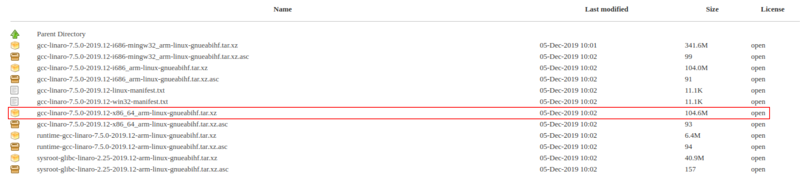

# Linux Device Drivers on BeagleBone Black

- [Host and target setup.](#host-and-target-setup)
- [Custom drivers.](#custom-drivers)

## Host and target setup

### Using a Docker container as a development environment

Start the docker container.

```console
docker run --rm -it -v ~/.gitconfig:/etc/gitconfig -v $(pwd):/home/ldd charlesdias/device_drivers_bbb:latest
```

### Setup a development environment on local machine

1. Install the packages on the host system
```console
sudo apt-get update
```
```console
sudo apt-get install build-essential lzop u-boot-tools net-tools bison flex libssl-dev libncurses5-dev libncursesw5-dev unzip chrpath xz-utils minicom wget git-core
```

2. Download the Linaro toolchain. Access the link https://releases.linaro.org/components/toolchain/binaries/latest-7/arm-linux-gnueabihf/ and download the file name `gcc-linaro-7.5.0-2019.12-x86_64_arm-linux-gnueabihf.tar.xz`



#### Toolchain installation and path settings

1. Extract the file `gcc-linaro-7.5.0-2019.12-x86_64_arm-linux-gnueabihf.tar.xz` to the Workspace directory. 

2. Access the Home folder and open .bashrc file
```console
cd ~ && vi .bashrc
```

3. And add the export command below to the end of the file
```console
export PATH=~/Study/Udemy/LinuxDeviceDriver/downloads/gcc-linaro-7.5.0-2019.12-x86_64_arm-linux-gnueabihf/bin/:$PATH
```

4. Save and close the file. To update the modification type the command `source .bashrc` or pefome a logoff and login.

5. To validate if everything is right, type the command `arm` in the console and press the keyboard **TAB**. The output are expected
```console
charlesdias@charlesdias:~/Study/Udemy/LinuxDeviceDriver$ arm
arm2hpdl                           arm-linux-gnueabihf-gcc-7.5.0      arm-linux-gnueabihf-ld
arm-linux-gnueabihf-addr2line      arm-linux-gnueabihf-gcc-ar         arm-linux-gnueabihf-ld.bfd
arm-linux-gnueabihf-ar             arm-linux-gnueabihf-gcc-nm         arm-linux-gnueabihf-ld.gold
arm-linux-gnueabihf-as             arm-linux-gnueabihf-gcc-ranlib     arm-linux-gnueabihf-nm
arm-linux-gnueabihf-c++            arm-linux-gnueabihf-gcov           arm-linux-gnueabihf-objcopy
arm-linux-gnueabihf-c++filt        arm-linux-gnueabihf-gcov-dump      arm-linux-gnueabihf-objdump
arm-linux-gnueabihf-cpp            arm-linux-gnueabihf-gcov-tool      arm-linux-gnueabihf-ranlib
arm-linux-gnueabihf-dwp            arm-linux-gnueabihf-gdb            arm-linux-gnueabihf-readelf
arm-linux-gnueabihf-elfedit        arm-linux-gnueabihf-gdb-add-index  arm-linux-gnueabihf-size
arm-linux-gnueabihf-g++            arm-linux-gnueabihf-gfortran       arm-linux-gnueabihf-strings
arm-linux-gnueabihf-gcc            arm-linux-gnueabihf-gprof          arm-linux-gnueabihf-strip
charlesdias@charlesdias:~/Study/Udemy/LinuxDeviceDriver$ arm
```

### Target setup

1. Download the last Debian image for BeagleBone Black. Acess the link `https://beagleboard.org/latest-images` and check the title **Recommended Debian Images** and download, for example, the [AM335x 11.7 2023-09-02 4GB microSD IoT](https://files.beagle.cc/file/beagleboard-public-2021/images/am335x-debian-11.7-iot-armhf-2023-09-02-4gb.img.xz). Or we can use our own Linux image built through Yocto Project.

2. Open the balenaEtcher software.

3. Select the core-image-minimal-beaglebone.wic.xz file.

4. Select the USB flash driver and click on Flash button.

5. Once the process is complete, unmount and remove the SD card.

6. Insert the SD card into BBB.

7. Press the boot button (S2) and power up the BBB.

8. Release the S2 button after 2 to 5 seconds.

## Linux kernel compilation - Version 5.10

1. Clone the branch 5.10-rt.

```console
git clone -b 5.10-rt https://github.com/beagleboard/linux.git linux_bbb_5.10-rt
```

2. Access the linux_bbb_5.10-rt folder and run the docker image
<!-- ```console
sudo docker run -it -v $PWD:/home/ldd/ charlesdias/ubuntu-bbb:latest
``` -->

```console
docker run --rm -it -v ~/.gitconfig:/etc/gitconfig -v $(pwd):/home/ldd charlesdias/device_drivers_bbb:latest
```

3. If necessary, removes all the temporary folder, object files, images generated during the previous build.
```console
make ARCH=arm distclean
```

4. Creates a .config file by using default config file given by the vendor
```console
make ARCH=arm bb.org_defconfig
```

5. Run this command to update the .config file settings before compile.​
```console
make ARCH=arm CROSS_COMPILE=arm-linux-gnueabihf- menuconfig
```

6. Kernel source code compilation. This stage creates a kernel image "uImage" also all the device tree source files will be compiled, and dtbs will be generated. ​

```console
make ARCH=arm CROSS_COMPILE=arm-linux-gnueabihf- uImage dtbs LOADADDR=0x80008000 -j8
```

7. Building and generating in-tree loadable(M) kernel modules(.ko)

```console
make ARCH=arm CROSS_COMPILE=arm-linux-gnueabihf- modules -j8
```

8. Extract the modules.

```console
mkdir -p ../../kernel_modules && make ARCH=arm CROSS_COMPILE=arm-linux-gnueabihf- INSTALL_MOD_PATH=../../kernel_modules modules_install -j $nproc
```

**Attention: If it runs the `sudo make ARCH=arm modules_install` command, these module will be installed on the host machine into /lib/modules/<kernel_version> folder.**

## Update the boot images and modules in SD card

1. Connect the SD card to computer

2. Access the host console terminal and copy the uImage from linux_bbb_4.14/arch/boot to the boot partition

```console
cp BeagleBoneBlack/linux_source/linux_bbb_5.10-rt/arch/arm/boot/zImage /media/<user-name>/<boot-partition-name>/
```

3. Copy module files root partition

```console
sudo cp -a BeagleBoneBlack/kernel_modules/lib/modules/5.10.162/ /media/<user-name>/<root-partition-name>/lib/modules/5.10.162
```

4. Run the sync command

```console
sync
```

5. Removes the SD card and connect it to the BBB.

6. After login, run the command 

```console
uname -r
```

7. The expected result is

```console
root@beaglebone:~# uname -r
5.10.162
```

## Custom drivers

-[Example 001hello_world readme.](custom_drivers/001hello_world/README.md)
-[Example 002pseudo_char_driver readme.](custom_drivers/002pseudo_char_driver/README.md)
-[Example 003pseudo_char_driver_multiple readme.](custom_drivers/003pseudo_char_driver_multiple/README.md)
